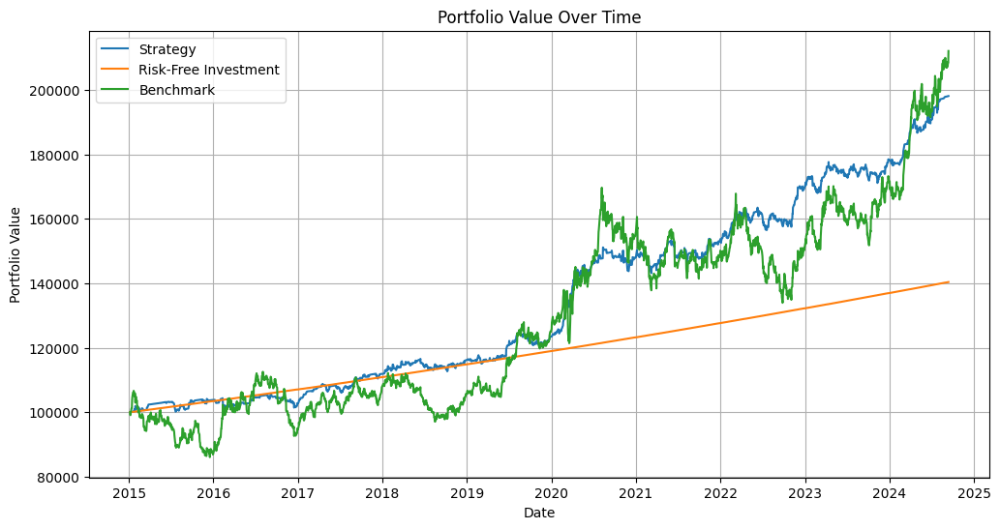

# Gold Futures Backtesting Strategy

## Overview

This notebook implements and backtests a trading strategy for Gold Futures, using a neural net for signal creation and a momentum-based approach, inspired by the research paper **"Alpha Momentum in Commodity Markets"**. The paper argues for the momentum alpha effect, that the momentum of returns is a statistically significant indicator for future returns. The authors showed that this is especially true for the commodity markets.  The strategy employs a feed forward neural network model to predict market movements, opening long or short positions based on confidence levels. The backtest evaluates how this strategy performs compared to a benchmark, calculating key metrics such as CAGR, Sharpe ratio, and drawdowns.

## Features

- **Machine Learning-Based Signals**: The strategy uses a neural network to predict future price movements based on historical data and momentum indicators.
- **Backtest Engine**: Simulates trades over historical data and adjusts portfolio values accordingly.
- **Performance Metrics**: Calculates portfolio metrics like Sharpe ratio, max drawdown, and volatility.
- **Risk Management**: The backtest monitors margin requirements and liquidates positions when risk limits are breached.

## How the Strategy Works

### 1. Signal Generation

The strategy uses a supervised learning model to predict price movements. The model is trained using a set of features, including:

- **Price Data**: Price, Open, High, Low, and Volatility.
- **Alpha Momentum Indicators**: RSI, CCI, ADX, and price changes over multiple moving averages (SMA) for alpha and prices.
- **Target Variable**: The model attempts to predict the `Target`, a binary label representing whether the market will move up or down.

The dataset is split using **TimeSeriesSplit** to ensure that the model is trained and tested on sequential data.

```python
from sklearn.model_selection import TimeSeriesSplit
from sklearn.metrics import accuracy_score

# Features and Target
X = df_standardized.iloc[:split_index][['Price', 'Open', 'High', 'Low', 'Vol.', 'RSI', 'CCI', 'RSI_Change', 'ADX', 'Change_SMA_3', 'Change_SMA_5', 'Change_SMA_7', 'Change_SMA_14', 'Last_Change']]
y = df_standardized.iloc[:split_index]['Target']

# Initialize TimeSeriesSplit
tscv = TimeSeriesSplit(n_splits=5)

for train_index, test_index in tscv.split(X):
    # Train/test split, scaling, and model training
```

### 2. Backtesting Logic

The backtesting process simulates the execution of trades based on the signals generated by the neural network. It follows these rules:

- **Opening Positions**: A long position is opened if the model predicts an upward trend with a confidence level above 70%. A short position is opened if the model predicts a downward trend with similar confidence.
- **Closing Positions**: Positions are closed when the model signals the opposite trend (i.e., a reversal in the signal).
- **Margin Management**: Each trade requires a margin based on the position size. If the portfolio experiences a margin shortfall or hits a predefined loss limit, positions are liquidated.

```python
class FuturesBacktester:
    def run_backtest(self):
        for current_date, row in self.df.iterrows():
            # Get the predicted direction and confidence level
            price = row['Price']
            preds = row['preds']
            y_pred_proba = row['y_pred_proba']
            
            # Risk-free portfolio value growth
            self.risk_free_portfolio_value *= (1 + self.daily_risk_free_rate)
            self.cash *= (1 + self.daily_risk_free_rate)

            if self.position_type is not None:
                # Position management and daily P&L
                daily_pnl = self.position_size * (price - self.entry_price)
                self.margin_account += daily_pnl
                self.entry_price = price

                # Liquidate if margin shortfall or loss limit
                if total_equity <= self.initial_portfolio_value * (1 + self.p_l_limit):
                    self.liquidate_position("LIQUIDATE (LOSS LIMIT)", current_date, price)
                    continue

                # Close positions based on new signals
                if self.position_type == 'long' and preds == 0:
                    self.close_position(current_date, price)
                elif self.position_type == 'short' and preds == 1:
                    self.close_position(current_date, price)

            else:
                # Open new positions based on confidence thresholds
                if preds == 1 and y_pred_proba >= self.confidence_threshold:
                    self.open_position(current_date, price, 'long')
                elif preds == 0 and (1 - y_pred_proba) >= self.confidence_threshold:
                    self.open_position(current_date, price, 'short')
```


### Performance Summary

- **Strategy Total Return: 98.09% vs. Benchmark Total Return: 112.10%**  
- **Strategy CAGR: 7.95% vs. Benchmark CAGR: 7.92%**  
- **Strategy Sharpe Ratio: 0.7433 vs. Benchmark Sharpe Ratio: 0.3587**  
- **Strategy Sortino Ratio: 0.8716 vs. Benchmark Sortino Ratio: 0.5030**  
- **Strategy Max Drawdown: -5.29% vs. Benchmark Max Drawdown: -21.07%**  
- **Strategy Calmar Ratio: 1.5033 vs. Benchmark Calmar Ratio: 0.3759**  
- **Strategy Volatility: 5.90% vs. Benchmark Volatility: 14.67%**  
- **Strategy Beta vs. Benchmark: -0.0002**  

### Key Insights

1. **Risk-Adjusted Returns**: The strategy significantly outperforms the benchmark in terms of risk-adjusted metrics (Sharpe and Sortino ratios). This shows the strategy's ability to provide better returns while taking on less risk, making it a great choice for investors looking to maximize returns with minimal volatility.
   
2. **Capital Protection**: The strategy's low drawdown and high Calmar ratio make this strategy strongly suited forcapital preservation during market downturns. The ability to limit losses to just -5.29%, compared to the benchmark’s -21.07%, is a crucial advantage in hedging against movements in the underlying futures markets.

3. **Low Volatility**: With much lower volatility compared to the benchmark, the strategy provides a more stable growth path.

4. **Market Independence**: The strategy’s near-zero beta demonstrates that it performed independently of the market, offering valuable diversification. This makes it a strong candidate for inclusion in a broader portfolio to reduce overall market risk.


### 4. Visualization

Our equity curve shows how 




## How to Run

1. **Install Required Libraries**:
   Run the following command to install the necessary Python packages:
   ```bash
   pip install pandas numpy matplotlib scikit-learn tensorflow colorama tabulate
   ```

2. **Prepare Data**:
   Load historical gold futures data, ensuring that your dataset includes the necessary features (price, technical indicators, etc.).

3. **Run the Notebook**:
   Execute each section of the notebook in order, starting with signal generation, followed by the backtest simulation, and then evaluating the strategy’s performance.

## Customization

- **Signal Adjustments**: The machine learning model’s architecture, features, and hyperparameters can be modified to improve accuracy.
- **Position Sizing**: Adjust the risk management system to reflect more aggressive or conservative trading approaches.
- **Risk Management**: You can add custom stop-loss or take-profit rules to further control downside risk.

### Next Steps
- **Optimize Parameters**: Run hyperparameter optimization on the model and strategy parameters (e.g., confidence threshold, position sizing).
- **Explore Other Assets**: This backtesting framework can be extended to test alpha momentum strategies on other commodity markets or asset classes.

